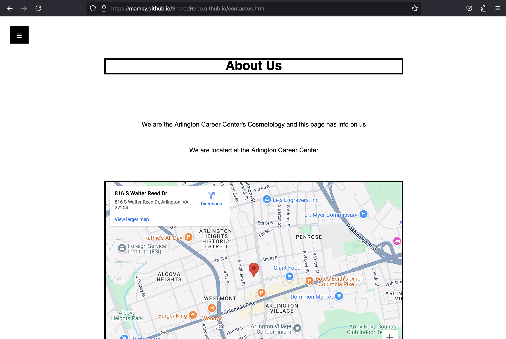

# **ACC Cosmetology Website**

[Website](https://mamky.github.io/SharedRepo.github.io/index.html)
[Repo](https://github.com/Mamky/SharedRepo.github.io)

My form was a POST method form and the input types I used were text, tel, email, and radio. 
## **Reflection**

I worked many days on the css, my pages and the nav bar that is used in our website. pulling and merging were quite tricky and branch based development was super hard so maybe we can go over that a bit more or just never do it again. The pull request took me a couple hours to do and it sorta destroyed our css and html for most of the pages.
